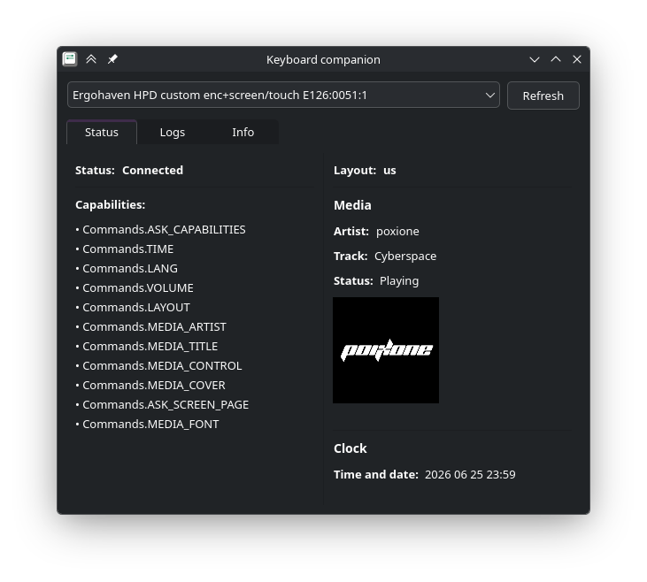

# Keyboard Companion

Companion app for QMK keyboard, that communicates via rawHID


## Capabilities

This software primarily made to send that information to keyboard:

- media info
  - name
  - artist
  - cover
- date and time
- custom font
- current layout

## Installation

```bash
flatpak-builder --install --user --force-clean build-dir manifest.yaml
```

## Run

You can run it in GUI mode or in CLI mode

### GUI

```
flatpak run dev.sirosh.keyboard-companion
```

Or just find it in application list and run

By default it will start in tray, you can expand it to view detailed info or choose another device


### CLI

```
flatpak run dev.sirosh.keyboard-companion list # outputs list of supported devices
flatpak run dev.sirosh.keyboard-companion connect --vid 0xAABB --pid 0xEEFF --interface 1 # connect to device
```

## Development setup

```bash
python -m venv .venv
source .venv/bin/activate
pip install -r requirements.txt
python src/sync.py
```

# Keyboard side

My implementation of how to sync with this app can be found [here](https://github.com/ARManakhov/custom-vial-qmk/blob/hpd/keyboards/sirosh/hid.c)
